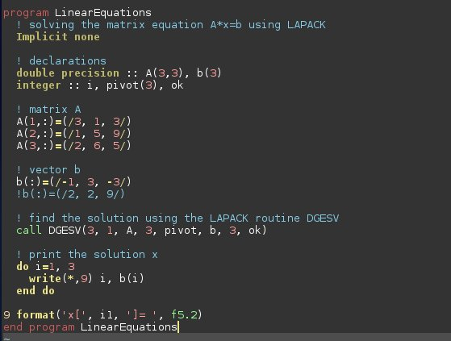

# Fortran Programming

[Home](https://www.mkdynamics.net)



## Introduction
In this section, we will discuss and experiment with Fortran programming. Fortran is a high-level programming language that is used for numerical and scientific computing. It is a general-purpose, compiled language that is especially suited to numeric computation and scientific computing. Fortran was originally developed by IBM in the 1950s for scientific and engineering applications. It has since been updated and improved, and is still widely used in scientific computing and high-performance computing.

Worked examples and exercises will be provided from the following textbooks and resources: <br>

## Table of Contents

::::{grid} 2 2 2 2
:class-container: text-center
:gutter: 3

:::{grid-item-card}
:link: Modern_Fortran/modern_fortran.html
:class-header: bg-dark

Modern Fortran
^^^
```{image} images/modern_fortran.jpg
:height: 300
```
:::

:::{grid-item-card}
:link: Intro_to_Fortran/intro_to_fortran.html
:class-header: bg-dark

Introduction to Programming Using Fortran
^^^
```{image} images/intro_fortran.jpg
:height: 300
```
:::

:::{grid-item-card}
:link: Guide_to_Fortran_2008_Programming/guide_to_fortran_2008_programming.html
:class-header: bg-dark

Guide to Fortran 2008 Programming
^^^
```{image} images/guide_fortran.jpg
:height: 300
```
:::

:::{grid-item-card}
:link: Fortran_MOOC/fortran_mooc.html
:class-header: bg-dark

PRACE MOOC on "Fortran for Scientific Programming"
^^^
```{image} images/prace_mooc.jpg
:height: 300
```
:::

::::


## Resources and Textbooks Used

In this section we will be programming in Fortran using examples and techniques found in these books and resources:  <br>

### "Guide to Fortran 2008 Programming" by Walter S.Brainerd
This book may be purchased here: <br>
[Amazon page to purchase "Guide to Fortran 2008 Programming" by Walter S. Brainerd"](https://www.amazon.com/Guide-Fortran-Programming-Walter-brainerd/dp/1447167589/ref=sr_1_1?crid=JARCJZJ2KJZN&keywords=guide+to+fortran+2008+programming&qid=1581908665&sprefix=guide+to+fortran+2008+programming%2Caps%2C189&sr=8-1)

### "Modern Fortran" by Milan Curcic (Manning Publications)
This book may be purchased from:
[Modern Fortran: Building Efficient Parallel Applications](https://www.manning.com/books/modern-fortran)

### "Introduction to Programming Using Fortran" from the Open Textbook Library
This online resource may be obtained here: <br>
[Introduction to Programming using Fortran](https://open.umn.edu/opentextbooks/textbooks/introduction-to-programming-using-fortran-95-2003-2008)

### PRACE MOOC on "Fortran for Scientific Programming" by FutureLearn
This online resource may be obtained from Github  [PRACE MOOC on "Fortran for Scientific Programming"](https://www.futurelearn.com/courses/fortran-for-scientific-computing)

### Project Code on Github

Project code is available at the following Github repositories:<br>
[Worked Examples in Guide to Fortran 2008 Programming](https://github.com/markkhusid/Guide-to-Fortran-2008-Programming)
                            
[Worked Examples in Introduction to Programming Using Fortran](https://github.com/markkhusid/Introduction-to-Programming-using-Fortran)

[Worked Examples in Modern Fortran](https://github.com/markkhusid/Modern_Fortran)

[PRACE MOOC on "Fortran for Scientific Programming" by FutureLearn](https://github.com/gjbex/Fortran-MOOC)