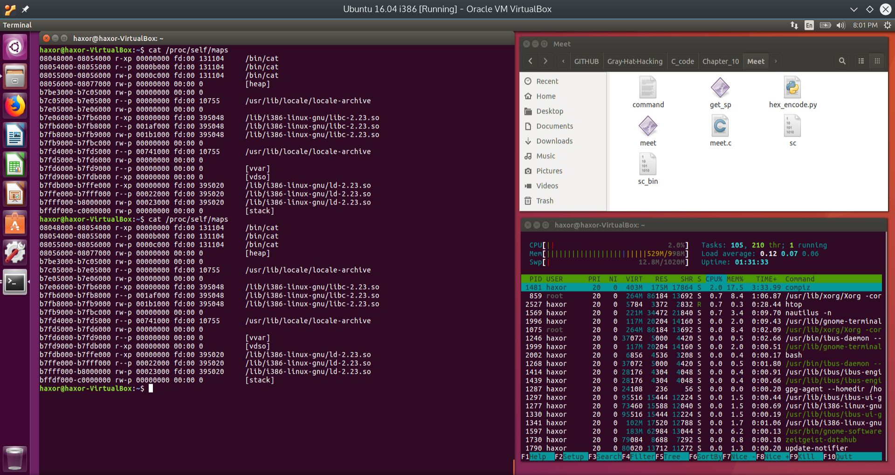
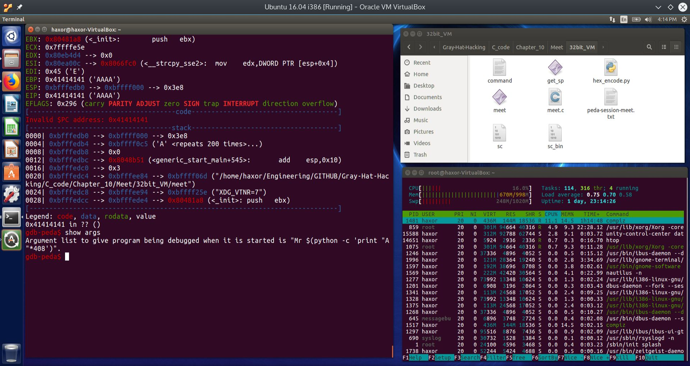

MK Dynamics
===========

Computer Security - Basic Linux Exploits
----------------------------------------

*   [Home](../../index.php)
*   [Back](computer_security.html)

* * *

Introduction
------------

This section will borrow heavily from "Gray Hat Hacking, The Ethical Hacker's Handbook", by Regaldo, et. al, McGraw Hill, 4th. Edition.  
[Gray Hat Hacking (Amazon)](https://www.amazon.com/Hacking-Ethical-Hackers-Handbook-Fourth/dp/0071832386/ref=sr_1_2?ie=UTF8&qid=1540671368&sr=8-2&keywords=gray+hat+hacking)

Note that there is a 5th Edition available at the time of this writing.

We will also make use of the classic discussion on Buffer Overflows by Aleph One.  
[Aleph One's Classic on Buffer Overflows.](https://insecure.org/stf/smashstack.html)

We will also use tips and tricks from the following:

Open Security Training's course on Introduction to Exploits 1  
[Open Security Training](http://www.opensecuritytraining.info/)  
  
"The Shellcoder's Handboook", by Anley et. al, Wiley, 2nd Edition  
[The Shellcoder's Handbook (Amazon)](https://www.amazon.com/Shellcoders-Handbook-Discovering-Exploiting-Security/dp/047008023X/ref=sr_1_2?ie=UTF8&qid=1540671203&sr=8-2&keywords=the+shellcoders+handbook)  

In this section, we will discuss trying to inject shellcode into a vulnerable program from the command line, investigate errors, and perform debugging of these errors with the Gnu DeBugger (GDB).

Smashing the Stack of a Vulnerable Program and Causing a Buffer Overflow
------------------------------------------------------------------------

### Introduction to Buffer Overflows and Preparing a 32-bit Ubuntu Virtual Machine

The following image was taken from the following presentation:  
  
Stack-Based Buffer Overflows Attacker  
By: Laurence Davis  
[Stack-Based Buffer Overflows](https://slideplayer.com/slide/4775349/)

Buffer overflow corrupting return address on the stack

By overfilling the function's local variables with data, one is able to overwrite the saved EIP (return pointer in the figure). This is a vulnerability in the way the kernel and C compiler handles function calls, because shellcode can be inserted onto the stack and the saved return address may be overwritten to point to the shellcode. However, as seen in the section on Shellcoding, modern kernels will not allow execution of data on the stack. So even though this vulnerability has for the most part been patched, we will still learn it because fundamentally, it is the basis for many such vulnerabilities, found even in modern kernels.

We will now investigate exploiting this vulnerability with a simple vulnerable C test program called _meet.c_ shown below.

The vulnerable C program: meet.c

[Click here to download meet.c](code/Basic_Linux_exploits/meet.c)

### Brief synopsis of meet.c

In the program _meet.c_, we include string.h in order to make use of the vulnerable strcpy command. The format of the strcpy command is as follows:  

> char \*strcpy(char \*dest, const char \*src);

From the man page for strcpy:  

> _The strcpy() function copies the string pointed to by src, including the terminating null byte ('\\0'), to the buffer pointed to by dest. The strings may not overlap, and the destination string dest must be large enough to receive the copy. Beware of buffer overruns!_

The program's main function reads in two arguments, which are stored in the argv array of strings. They are argv\[1\] and argv\[2\] for the first and second arguments, respectively.

The main function calls a function called _greeting_. Greeting has a local variable that is 400 bytes long called _name_. This local variable acts like an input buffer. In order to aid in understanding the memory layout of this program, I have added three diagnostic statements that print out the memory addresses of the local variable _name_, as well as the two function arguments, _temp1_ and _temp2._

Now this is where things get interesting. For educational purposes, the VERY vulnerable _strcpy_ function is called from within the function called _greeting_. What _strcpy_ will do is to copy the argument _temp2_ into the buffer _name_, WITHOUT any bounds checking. This means that if the argument _temp2_ is carefully crafted, the buffer _name_ can be overflowed. When it is overflowed, it will overwrite adjacent data, which includes the return address to the calling function main!

Normally used, the function called _greeting_ then prints out the string Hello, followed by the first argument, and the contents of the buffer called _name_. Control is then returned back to the main function, which prints out the string, Bye, followed by the first and second arguments from the command line. We will now investigate attacking the aforementioned built-in vulnerability in this program. But first, we must set up the environment.

### Disabling Address Space Layout Randomization (ASLR)

As mentioned previously, modern Linux kernels use several strategies to overcome vulnerabilities such as buffer overflows. One of these strategies is known as Address Space Layout Randomization (ASLR). Essentially, the kernel randomizes the process's address space, which includes the stack, thereby precluding the ability to brute force overwriting of the stored return address on the stack. Every attempt will require injection of a new malicious address that points back to the shellcode. This is extremely difficult to guess, if not impossible.

Another strategy is to simply not allow execution of data on the stack. Since the buffer and hence the injected shellcode resides entirely on the stack, execution of the shellcode will not be allowed by the kernel, and the process will crash.

To get around such protections, for pedagogical reasons, we will disable both ASLR and allow execution of data on the stack. This will require either recompiling the C program with executable stack or enabling executable stack at the kernel level. In order to disable ASLR, a bash shell may be opened with the following command:

> $ setarch i386 -R /bin/bash

or by disabling ASLR at the kernel level. To minimize variables, it is better to do this at the kernel level; however, this is not a good idea on your main system for security reasons. Therefore, we will spin up a 32-bit Ubuntu virtual machine and disable these protections at the kernel level, as shown in the image below:

Disabling ASLR in the 32-bit Ubuntu Virtual Machine

As can be seen from the screenshot above, it is not directly possible to disable non-executable stack or data execution protections, also called NX. This must be done at the UEFI or BIOS level. It is however, possible to disable ASLR by using the command:

> $ echo "0"> /proc/sys/kernel/randomize\_va\_space

In order test that the process' address space is not randomized, we issue the following command a few times and observe that the address space is constant between issuing the command:

> $ cat /proc/self/maps  
> \[.... memory layout table ....\]  
>   
> $ cat /proc/self/maps  
> \[.... unchanged memory layout table ....\]  
>   
> $ cat /proc/self/maps  
> \[.... unchanged memory layout table ....\]  
>   

The following screenshot shows these commands in the 32-bit Ubuntu VM:

Process memory map showing no randomization of address space layout

As can be seen from the above screenshot, the address space layout is not randomized. Each invocation of the cat /proc/self/maps command produces the same results. Of particular interest is that the stack's address remains constant at:  

> bffdf000-c0000000 rw-p 00000000 00:00 0 \[stack\]

Notice that the stack has permissions of rw, but not exectute.

In order to overcome the inability to disable non-executable (NX) stack or data segments at the kernel level, we will have to remember to issue special directives to the compiler when compiling vulnerable programs. These compiler directives are:  

> gcc ..._\-zexecstack -fno-stack-protector_...

The directive _\-zexecstack_ tells the compiler to enable an executable stack, while the directive _\-fno-stack-protector_ tells the compiler to disable stack corruption protections.

We are now ready to attempt to overflow the buffer of the vulnerable program from the command line.

Smashing the Stack of a Vulnerable Program and Causing a Buffer Overflow - Overflowing the Buffer of the Vulnerable Program meet.c
----------------------------------------------------------------------------------------------------------------------------------

### Compiling meet.c with NX disabled, with debugging information and static compilation

As described in the previous section, it is first necessary to compile meet.c with executable stack protections off. We will also include lots of debugging information, and we will compile the program with the _\-static_ flag, so that all of the called system libraries will be included in the executable. Having all of the called system libraries included tends to aid debugging, since the GNU Debugger (GDB) will not have to jump around memory as much. Finally, we will force 32-bit compilation. Since we will be running the executable on a 32-bit Virtual Machine (VM), this might be a moot point, but we will do it anyway to minimize differences in executable operation among different systems.

To compile meet.c, we issue the following command:  

> $ gcc -m32 -static -ggdb3 -zexecstack -fno-stack-protector -mpreferred-stack-boundary=2 meet.c -o meet

The results of this command are shown in the image below:

Compiling meet.c statically, with NX disabled and extensive debugging information

The command we used to compile meet.c had the following arguments:

Argument

Meaning

\-m32

Compile into 32-bit mode.

\-static

Compile the program statically, with all libraries included within the executable.

\-ggdb3

Include maximum debugging information.

\-zexecstack

Allow an executable stack. Basically one part in overiding NX.

\-fno-stack-protector

Disable stack corruption protections. Second part in overiding NX.

\-mpreferred-stack-boundary=2

Sets the size of each entry in the stack to 2^2=4 bytes long. This makes it easier four our data alignment purposes, since we will be dealing with 32-bit or 4 byte memory locations.

### Running the executable _meet_ normally

We run the program _meet_ normally with the arguments Mr Mark as follows:  

> $ ./meet Mr Mark

After issuing the command, we get the following output:

Running the executable meet normally with the arguments Mr Mark

As can be seen from the above screen capture, the program prints out the memory addresses of the buffer we will overflow, which is the 400 byte buffer called _name_. It also prints out the memory addresses of the two arguments, _temp1_ and _temp2_. The astute observer will notice that these addresses are actually within the stack segment! Notice also that _temp2_ is exactly 4 bytes away from _temp1._

The program then prints out the string Hello, followed by the program arguments. Finally, the program prints out the string Bye, followed by the program arguments.

### Fuzzing the inputs to the executable _meet_

To find the size of the buffer, we will increase the number of bytes input into the second argument until the program begins to crash. Actually, we could have tried the first argument, but we would have found that the first argument is very resilient, since it is not actually taking part in the vulnerable strcpy command. This could have been surmised from reverse engineering the binary, if the source code was not available. Below we show what happens even when we inject 500 "A"'s into the first argument. In the second image, we will attempt to insert 2000 "A"'s and see what happens.

Attempt at fuzzing first argument with 500 "A"'s into the executable _meet_

In the figure above, we first try 10 "A"'s and then 500 "A"'s, and nothing seems to break. Again, this is because only the second argument participates in the vulnerable strcpy command. To make absolutely sure, in the figure below, we inject 2000 "A"'s into the first argument of the executable _meet_.

Attempt at fuzzing first argument with 2000 "A"'s into the executable _meet_

In the figure above, nothing seems to break. We therefore focus on the second argument. Our goal is to find the size of the vulnerable buffer, so we start low and work our way up until we encounter a segmentation fault. This fault will indicate that our input has overwritten the return address of the the main function within the executable _meet_.

Attempt at fuzzing the second argument with an increasing number of "A"'s into the executable _meet_

Still no segmentation faults. We continue increasing the number of "A"'s in the figure below.

Segmentation fault found!

We can see that we have found the segmentation fault after injecting 400 "A"'s into the second argument. 398 and 399 did not do it. From this we can surmise that the first argument "Mr" took two bytes and the second argument took 400 bytes, and this was enough to overwrite the main function's return address. Since the saved base pointer took four bytes and the saved return address took an additional four bytes, we have probably overwritten the saved base pointer, at which the main function used this corrupted base pointer for its stack frame operations. But since we have corrupted the saved base pointer, the program tried to access an invalid part of memory, and hence we obtained the segmentation fault.

From this we can surmise that the vulnerable buffer size is about 400 bytes. Let us fire up the Gnu DeBugger on the segmentation fault and see what happened. Before we do this, we install the PEDA extension for GDB to make life easier. This can be found at:  
[Python Exploit Development Assistance](https://github.com/longld/peda)

Finding root cause of the segmentation fault

We can see from GDB that the exact instruction that caused the segmentation fault was found at the address main+35:

The instruction attempted to load into EDX the contents of the memory address pointed to by EAX. We can observe that the contents of the registers was:

Looking specifically at EAX, it contained 0x41414149. 0x41 is the ASCII code for the capital A. We can see that when the CPU tried to access the contents of the memory location pointed to by EAX, we got the segmentation fault. This is because the memory address 0x41414149 is outside of the program's allowable access segments.

What appears to have happened is that the return address was not overwritten, because the program was able to return to main. However, it appears that argc and argv where overwritten by the buffer overflow. Recall that argc contains the number of arguments, including the command itself. In our case, argc would have been 2, since it starts at 0.

argv\[ \] is an array of strings. Each string in argv are the arguments, where argv\[0\] is the command itself. In our case, argv\[1\] would have been "Mr" and argv\[2\] would have been 400 "A"'s. What we are really after is to overwrite EIP. To do that, we will have to add an additional 8 "A"s, which equals a total of 8 bytes. 4 of those bytes will overwrite the saved EBP, and the other 4 bytes will overwrite the saved EIP. We show the results of running _meet_ with 408 "A"'s for the second argument in the screen shot below:

Overwriting EIP by injecting 408 "A"'s into the second argument to the executable _meet_

Now that we have found a way to overwrite EIP, we can basically get the processor to execute arbitrary code within the processes memory segment. If we could insert shellcode into the second argument, and then overwrite the return address to point to the start of the shellcode, then we will cause the process to spawn a shell. If this process was running under root privileges, then the shell will be a root shell, where we can basically control the entire system. Let us try to do this from the command line.

Inserting Shellcode into a Vulnerable Processs from the Command Line to Obtain a Command Shell
----------------------------------------------------------------------------------------------

In this section, our goal is to try to insert shellcode into the vulnerable executable _meet_. We will then do the same thing in GDB to see exactly what happens.

We will approah this section by showing a successful attack of a vulnerable program from the command line, and then dissect every aspect of how this was achieved. In order to show how dramatic such an attack can be, we will escalate the privileges of the vulnerable program to that of super user (SUID). This will cause the vulnerable program to drop out of normal execution and into a command shell with root privileges.

Changing the execution privileges of the executable _meet_ to SUID

By issuing the command:

> $ sudo chmod u+s meet

we give the executable _meet_ the privileges to execute at the root level.

**NOTE! DO NOT LEAVE A VULNERABLE EXECUTABLE WITH SUID ROOT PRIVILEGES ON YOUR SYSTEM AFTER YOU ARE DONE!**

We then inject our attack payload into the second parameter, because as discussed previously, the first parameter is not vulnerable to this attack. The attack and results are shown below:

Injecting payload into the vulnerable parameter of the executable _meet_ to obtain a root shell

SUCCESS!  
  
By issuing the command:

> $ sudo ./meet mr "$(perl -e 'print "\\x90"x200'; cat sc; perl -e 'print "\\x90"x27' ;perl -e 'print "\\x18\\xf2\\xff\\xbf"x38')"

we were able to overflow a buffer within the executable _meet_, and overwrite the return address. By doing so, we hijacked the instruction pointer EIP to execute our arbitrary code. In this case, our arbitrary code was shellcode, which provides a command shell. Since the executable _meet_ ran at the root privilege level, once the shell is spawned, any command entered runs at the root privilege level.

We will now break down the attack string in great detail.

* * *

Breaking Down the Attack String in Detail
-----------------------------------------

### Use of the "$(_cmd_; _cmd_; _cmd_; _cmd_)" format

The attack string used the format:

> "$(_cmd_; _cmd_; _cmd_; _cmd_)"

The shell command format $() replaces the unweildy backtick " \` " format, making an entered command much easier to read and understand. Individual commands within the parentheses can be separated by a semicolon. The quotation marks on the outside, i.e. "$()" tell the command shell to treat everything within the quotes as a literal string. See below for examples:

Demonstration of the effect of quotation marks at the Linux command prompt

As can be seen from the above screen shot, putting separated commands into quotes causes everything contained within the quotes to be treated as a single string. This is a good property for injecting shellcode from the command line into a vulnerable executable.

We will now examine using $() and "$()" on the command line.

Using $() and "$()" on command line

As can be seen from the screenshot above, putting commands separated by a semicolon within $(), causes the the output of the commands to be substituted into their place and the output to be executed by the shell. In the case of the first command _date_, the output is Sun, for Sunday, and the shell tries to execute Sun, but this is not a valid Linux command, so the command shell throws an error.

Alternatively, putting multiple commands separated by a semicolon within "$()" causes all of the commands to be executed, and the outputs of all of the commands are substituted in, wherein the shell tries to execute the outputs as if they were an actual shell command. That is why the shell returns an error in the screenshot above.

We will now put these concepts together to craft an attack string.

### Using "$()" to craft an attack string

We begin by using two shell commands:  

> perl -e '_perl command_'  
>   
> xxd _filename_

These commands can be broken down as follows:

Command

Meaning

perl -e '_perl command_'

Execute perl command contained within the single quotes

xxd _filename_

Creates a hex dump of a given file or standard input.

We will craft an attack string using perl commands and pipe the output of the attack string into xxd, to see whether the hexadecimal values align properly in memory and do not contain any bad characters, such a null byte, i.e. \\x00, or the linefeed character, i.e. \\x0a. The null byte is bad because many string processing functions in C interpret the null byte as the end of the string. So if our attack string contains a null byte in the middle of it, then only a portion of the attack string will enter into the vulnerable function. This will cause the attack string to fail. Likewise, the linefeed character will cause the parsing units of the string manipulation functions to interpret the linefeed as a user hitting the enter key. This will again cause premature failure of the attack string.

Let us try a simple example, such as:

Example of piping data into xxd to observe the hexadecimal values of the characters

In the above screenshot, we use the echo command to take the entire output of the commands within the "$()" and echo it to the screen. However, since we are using the unix pipe, the output is instead piped to the xxd command, which displays the hexadecimal values of the characters. Notice that there is a problem right at the end. There is a 0x0a character, which is the linefeed that the echo command affixes to the end. To suppress this trailing linefeed, the -n switch is used with the echo command. In the second issuance of the echo command, the trailing linefeed is suppressed, and we get a nice collection of hexadecimal values to fill 64 spots.

We can now move forward with constructing the attack string.

* * *

### Putting it all together

Recall that the attack string was:

> $ sudo ./meet mr "$(perl -e 'print "\\x90"x200'; cat sc; perl -e 'print "\\x90"x27' ;perl -e 'print "\\x18\\xf2\\xff\\xbf"x38')"

We will focus on everything contained within the "$()" by piping it into xxd and seeing what we are actually putting into the vulnerable buffer.

Piping the attack string into xxd

From the above screenshot, we can see that the attack string contains a prologue of 0x90 characters. The 0x90 is the hexadecimal value of the opcode for No OPeration, or the NOP. Since the CPU can not distingush data from executable code, the CPU begins executing the **_data_ as if it were _code_**. This prologue of NOP instructions is called a NOP sled. The NOP sled is used to make it easier by relieving the requirement to be absolutely exact with the return address at the end of the attack string. The CPU's instruction pointer needs to be made to fall anywhere within this NOP sled, so that it will begin sliding down the NOP sled and eventually hit the shellcode. We have highlighted the shellcode for clarity. The shellcode was developed within another section of this website and can be found here:  
  
[Shellcode Generation](shellcode_generation_and_testing.html)

How can we make the CPU's instruction pointer point to somewhere in the NOP sled? This is where real hacking skill comes in. After the NOP sled and shellcode, we need to overflow the rest of the buffer with the memory address _of the buffer_.

From where do we get this address? In our case, we have access to the source code and debugging information. Without the source code and debugging information, we would need to engage in reverse engineering of the executable. This is not impossible, but obviously much harder to do. For our purposes here, we will work on the easier case of knowing the exact memory address of the buffer we wish to overflow.

In our easier case, there are two ways of finding out the memory address of the buffer we wish to overflow.  

*   Modifiying the source code to print out the memory address of the buffer.
*   Using the debugger GDB to find out the memory address of the buffer.

This may seem to easy to many of you, and indeed it is. So we will also explore trying to overflow the buffer when knowing only the location of the stack pointer.

* * *

### Discovering the memory address of the buffer we wish to overflow

We now explore how to discover the memory address of the buffer we wish to overflow. Recall that when running the vulnerable executable _meet_ with normal inputs, we obtain the following output:

Discovering the memory address of the buffer we want to overflow. The buffer is called "name".

We can see from the above screenshot that the memory address of the buffer that we want to overflow is:

> The address of the name array is: 0xbfffee28

The memory address 0xbfffee28 is what we need to append to the end of the shellcode enough times so that this address will overwrite the saved EIP. By doing so, when the CPU reaches the _ret_ assembly instruction as it leaves the called function _greeting_, it will load the instruction pointer with the memory address 0xbfffee28, and then begin execution of the instructions there. Those instructions are the NOP sled, followed by our shellcode!

Of course, it is not always that simple. This address needs to be four byte aligned and input into the attack string in reverse order, since memory in IA32 is written in Little-Endian format. So in the case of 0xbfffee28, we would write it as \\x28\\xee\\xff\\xbf. In order to align the address to 4 bytes, we will need to add some NOP instruction padding so that the address 0xbfffee28 does not sit in the next byte location in memory after the shellcode, but rather in a fresh new 32 bit (4 byte) location. Otherwise, this address will be a shifted version of itself when the CPU tries to read it off of the stack. In that case, the address may be read as 0xee28bfff or 0xffee28bf. I both of those cases, the program will most certainly crash with an out of bounds or illegal instruction segmentation fault.

Note that this address may change slightly with each execution of the program _meet_; therefore, some persistance is necessary when attacking from the command line. We will now explore using the debugger GDB for finding out the address of the buffer we want to overflow. Refer to the screenshot below:

Discovering the memory address of the buffer we want to overflow. The buffer is called "name".

We can see from the GEF User Interface (UI) to GDB that we are at the vulnerable _strcpy_ function:

> strcpy (name, temp2); // copy the function argumemt to name

By the C calling convention, arguments passed to a function are pushed onto the stack in reverse order. We can see from the screenshot that _temp1_ is at ESP+8, ESP+4 contains the memory address of _temp2_ and at ESP we have the memory address of the local variable _name_. In this case, the memory address is 0xbfffea58. Note that we are looking for the memory address of the local variable _name_, NOT what the register ESP (stack pointer) points to, but rather what is at the memory address that the ESP points to. In other words, ESP points to an address on the stack, 0xbfffea50, and at this memory address, there is stored another memory address which is 0xbfffea58. The contents of the memory location at the address 0xbfffea58 is the value 6, which is really just a random value, since the local variable _name_ is uninitialized.

To confirm these statements, we observe the stack after the strcpy function returns.

State of CPU registers, stack and relevant memory addresses after the strcpy command.

We can see from the above screen shot that the passed argument _temp2_, at stack memory location 0xbfffea54, has been copied to stack location 0xbfffea50. These correspond to ESP + 4 and ESP respectively.

We also observe that the function strcpy returns a pointer to a character (i.e. a string), and by convention, this pointer is returned into the register EAX. From the Linux man page for strcpy:

> char \*strcpy(char \*dest, const char \*src);

We can observe from the above screenshot that the returned value into EAX is: 0xbfffea58, which is the memory address of the local variable _name_ on the stack. This is the memory address of the buffer we need to overflow.

### Calculating how many bytes we need to inject into the vulnerable buffer to overwrite the instruction pointer EIP.

So how many attack string bytes do we need to put onto the stack? We will need to fill up 400 bytes of the buffer called _name_. This is the local variable in the function greeting. Then we need 400 bytes for the argument passed to the function greeting called _temp2_, 4 bytes for the argument passed to the function greeting called _temp1_. Finally we need 4 bytes for the saved EBP. That is a total of 808 bytes. The next 4 bytes that we must overwrite is the **saved instruction pointer EIP**.

See the below screenshots for the state of execution just before the saved EIP is popped off of the stack, and execution is supposed to return back to the main function in the executable _meet_. Execution never returns to the main function, but instead the shellcode is executed.

### State of execution just before the saved EIP is popped off of the stack, and execution is supposed to return back to the main function in the executable _meet_, according to the GEF UI for GDB.

Stack just before return to main as per GEF.

Stack just before return to main as per PEDA

We can see from the above screenshots, for both the PEDA GDB UI and the GEF GDB UI, that the memory address of the _name_ local variable is: 0xbfffef3a. However, the address of the top of the stack is different. For GEF it is 0xbfffebec, and for PEDA it is 0xbfffec0c. This discrepancy was caused by the executable _meet_ being started as two different processes, each with its own address space. One process was started for GEF, and another one for PEDA.

Therefore we should not be surprised that the top of the stack is different on each invocation of an executable, even with address randomization turned on. To make the calculation, we simply subtract the address of the top of the stack from the address of the buffer. In both cases, we obtain the following calculations:

GDB UI Name

Memory Address of Buffer

Memory Address of Top of Stack

Difference in Hex \[bytes\]

Difference in Decimal \[bytes\]

GEF

0xbfffef3a

0xbfffebec

0x34e

846

PEDA

0xbfffef3a

0xbfffec0c

0x32e

814

Stated mathematically, we have:

> GEF 0xbfffef3a - 0xbfffebec = 0x34e bytes = 846 bytes  
>   
> PEDA 0xbfffef3a - 0xbfffec0c = 0x32e bytes = 814 bytes

The astute reader will notice that we calculated the theoretical number of bytes needed to overwrite the saved EIP was 812 bytes. However, in both cases, GEF and PEDA, we have more than 812 bytes. The reason is that we are allowed to overwrite even through the top of the stack, as long as the saved EIP is overwritten with the address of the overflowed buffer, and this address is aligned correctly to 4 bytes. If it is misaligned, then instead of reading 0xbfffef3a from the top of the stack, the CPU might read a shifted version of this. If this happens, the CPU will jump to this shifted version of the address that we want, and will most likely halt on a segmentation fault.

In order to verify that the attack string arranges its return addresses correctly aligned to 4 bytes, we could do a number of things. Within GDB, we could simply issue the following command:

Examining stack memory 812 bytes below ESP

Referring to the screenshot above, we wanted to observe the contents of stack memory starting at ESP and going down by 812 bytes. Notice that since the stack grows downward, we need to do the opposite operation, and _add_ 812 bytes, rather than subtract. To look at a byte, we need two hexadecimal digits; therefore, looking at 300 hexadecimal digits will show us 900 bytes. This will enable us to see our entire attack string in stack memory, with some margin. To accomplish this, we enter the following command:

> (gdb) x/300x $esp+812

Notice from the above screenshot that there is a NULL byte just ahead of our NOP sled. Since we are aiming for the middle of the NOP sled, this leading NULL bytes is of little consquence. Now that we have discovered the address of the vulnerable buffer, and figured out how many bytes we need to inject into it for a successful buffer overflow, we will now look at how to discover the stack address from the command line.

Discovering the memory address of the stack
-------------------------------------------

### Variations in the top of the stack with multiple attack attempts from the command line

Before we can figure out the return address to place onto the stack so that we can successfuly overwrite the saved EIP, we need to know the current address of the stack. This is a little bit tricky, because every time the attack is attempted, the stack address changes a little bit, even with ASLR turned off. The reason is that Linux tries to reclaim memory after the failed attack completes, and other processes are always executing at the same time, so the stack address tends to shift around a bit, by about 500 to 1000 bytes.

While this is not a large range, it is enough to render the attack string useless, as it will probably crash with a segmentation fault, or the attack will simply be ignored. This all depends on which way the top of the stack has shifted in memory. However, command line attacks are still possible as the stack will most likely stay at the same location for a few attempted attacks.

In the next section, we will demonstrate a small C program that can print out the current memory address of the stack.

Discovering the memory address of the stack
-------------------------------------------

### A small program that displays the current state of the stack pointer

To discover the address of the stack segment in memory, we use the program listed below

The program uses inline assembly within C. By convention, a the return value of a C function returns is contained within EAX. By calling the function get\_sp, the ESP register is copied to EAX and returned to the printf statement. In this way, we obtain what is contained within ESP, the top of the stack.

This returned value is printed out as a memory address via the 0x%x format string. The screenshot below will display the output of running this program a few times.

Running get\_sp many times to obtain the same memory address of the stack

Now that we have the address of the stack, or ESP, we can now make the calculation to figure out the return address that we want to append to the end of our attack string. We use our trusty HP48G calculator emulator for this purpose.

(A)

(B)

(C)

Referring to the above calculator images: in (A) we have the address of the stack, 0xbfffee98 and 812 bytes that we will subtract; in (B) we have the same as in (A), but the 812 in decimal was converted to hex for clarity; and in (C) we have the result of the subtraction.

### Lorem

#### Lorem

Lorem

Lorem

#### Lorem

Lorem

Lorem

#### Lorem

Lorem

Lorem

Lorem

Lorem

Lorem

### Lorem

#### Lorem

Lorem

#### Lorem

Lorem

Lorem

#### Lorem

Lorem

Lorem

#### Lorem

Lorem

Lorem

Lorem

Lorem

Lorem

Lorem