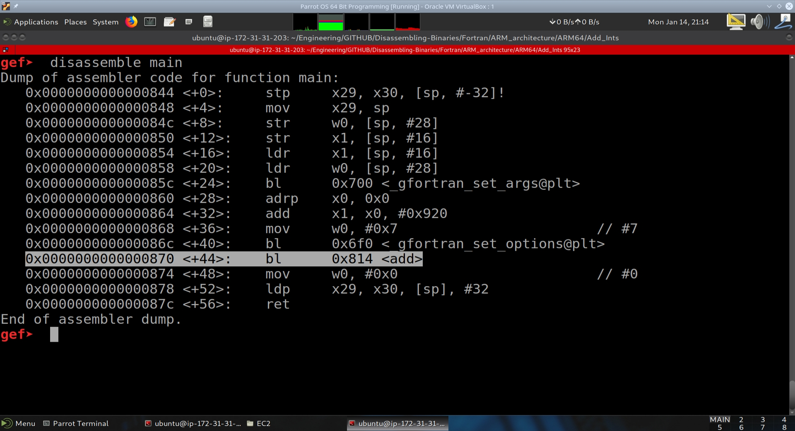

# Fortran - ARM 64-Bit Platform - Add Two Integers

```{image} images/add_Fortran_ARM64_splash.jpg
:height: 600
:width: 800
```

## Introduction

In this section we will be disassembling simple binaries generated by the Fortran high-level language compiled for the 64-bit ARM platform. We will disassemble the binaries using GDB+GEF as well Radare2.

Project code for this section is contained in my [https://github.com/markkhusid/Disassembling-Binaries/tree/master/Fortran/ARM_architecture/ARM64](https://github.com/markkhusid/Disassembling-Binaries/tree/master/Fortran/ARM_architecture/ARM64).

---

## The program *add.f08*

```{literalinclude} code/add_int.f08
:language: fortran
```

The program displays the contents of the program *add_int.f08*. The program creates three integers: a, b, and c. `a` is assigned the value of 1, `b` is assigned the value of 9, and `c` is assigned the result of the operation `a + b`.

The program is obviously very simple, with no inputs and outputs. The idea is to generate the binary and look at the disassembly to learn about the workings of the 64-bit ARM processor platform.

The chosen test system is an instance on Amazon Web Services. This is a new service that is powered by a 64-bit ARMv8 processor. It fits very well for this application due to its availability and ease of access from multiple remote systems via SSH.

The program is compiled with:

```bash
$ gfortran -ggdb3 add.f08 -o add_int_Fortran_aarch64_ggdb3
```

For general edification, we also have `gfortran` produce generic assembly with the `-S` option, an object file with the `-o` option, and object dumps of the object and executable files.

The generic assembly is generated by using the `-S` (assembly) option:

```bash
$ gfortran -S -ggdb3 add.f08 -o add.s
```

The object file is generated by using the `-c` (compile) option:

```bash
$ gfortran -c -ggdb3 add.s -o add.o
```

The objdump files are generated by using the following command and options:

```bash
$ objdump -x -D -S -s -g -t add.o > objdump_of_dot_o.txt
$ objdump -x -D -S -s -g -t add_int_Fortran_aarch64_ggdb3 > objdump_of_dot_exe.txt
```

A rundown of the objdump options is shown here:

```bash
$objdump 
Usage: objdump <option(s)> <file(s)>
 Display information from object <file(s)>.
 At least one of the following switches must be given:
  -a, --archive-headers    Display archive header information
  -f, --file-headers       Display the contents of the overall file header
  -p, --private-headers    Display object format specific file header contents
  -P, --private=OPT,OPT... Display object format specific contents
  -h, --[section-]headers  Display the contents of the section headers
  -x, --all-headers        Display the contents of all headers
  -d, --disassemble        Display assembler contents of executable sections
  -D, --disassemble-all    Display assembler contents of all sections
      --disassemble=<sym>  Display assembler contents from <sym>
  -S, --source             Intermix source code with disassembly
      --source-comment[=<txt>] Prefix lines of source code with <txt>
  -s, --full-contents      Display the full contents of all sections requested
  -g, --debugging          Display debug information in object file
  -e, --debugging-tags     Display debug information using ctags style
  -G, --stabs              Display (in raw form) any STABS info in the file
  -W, --dwarf[a/=abbrev, A/=addr, r/=aranges, c/=cu_index, L/=decodedline,
              f/=frames, F/=frames-interp, g/=gdb_index, i/=info, o/=loc,
              m/=macro, p/=pubnames, t/=pubtypes, R/=Ranges, l/=rawline,
              s/=str, O/=str-offsets, u/=trace_abbrev, T/=trace_aranges,
              U/=trace_info]
                           Display the contents of DWARF debug sections
  -Wk,--dwarf=links        Display the contents of sections that link to
                            separate debuginfo files
  -WK,--dwarf=follow-links
                           Follow links to separate debug info files (default)
  -WN,--dwarf=no-follow-links
                           Do not follow links to separate debug info files
  -L, --process-links      Display the contents of non-debug sections in
                            separate debuginfo files.  (Implies -WK)
      --ctf[=SECTION]      Display CTF info from SECTION, (default `.ctf')
      --sframe[=SECTION]   Display SFrame info from SECTION, (default '.sframe')
  -t, --syms               Display the contents of the symbol table(s)
  -T, --dynamic-syms       Display the contents of the dynamic symbol table
  -r, --reloc              Display the relocation entries in the file
  -R, --dynamic-reloc      Display the dynamic relocation entries in the file
  @<file>                  Read options from <file>
  -v, --version            Display this program's version number
  -i, --info               List object formats and architectures supported
  -H, --help               Display this information
```

In our case, we want `-x` (all headers), `-D` (disassemble all), `-S` (display source code with assembly), `-s` (full contents of all sections), `-g` (debug info), and finally, `-t` (display contents of the symbol tables).

We will now disassemble this program on the 64-bit ARM platform and step through the assembly instructions.

---

## Disassembling *add_int_Fortran_aarch64_ggdb3* in GDB + GEF

The debug process is started by entering:

```bash
$ gdb add_int_Fortran_aarch64_ggdb3
```

We then want to disassemble `main`. Looking at main's disassembly, we notice a call at `main+44` to a function at address `0x870` called *add*. We then do a disassembly on this function as well.



---

## Running *add_int_Fortran_aarch64_ggdb3* in GDB + GEF

When we look at the executable's objdump, we notice that there are two functions of interest, one is `main`, and the other is `MAIN__`. The Fortran compiler sets up the program arguments and options in `main`, while the actual program is contained within `MAIN__` (that is capital MAIN followed by two underscores).

The following text from the executable's objdump illustrates this:

```bash
00000000000007c4 (MAIN__):
program add
 7c4: d10043ff sub sp, sp, #0x10

    implicit none

    integer    :: a, b, c

    a = 1
 7c8: 52800020 mov w0, #0x1                    // #1
 7cc: b9000fe0 str w0, [sp, #12]
    b = 9
 7d0: 52800120 mov w0, #0x9                    // #9
 7d4: b9000be0 str w0, [sp, #8]

    c = a + b
 7d8: b9400fe1 ldr w1, [sp, #12]
 7dc: b9400be0 ldr w0, [sp, #8]
 7e0: 0b000020 add w0, w1, w0
 7e4: b90007e0 str w0, [sp, #4]

end program add
 7e8: d503201f nop
 7ec: 910043ff add sp, sp, #0x10
 7f0: d65f03c0 ret

00000000000007f4 (main):
 7f4: a9be7bfd stp x29, x30, [sp, #-32]!
 7f8: 910003fd mov x29, sp
 7fc: b9001fa0 str w0, [x29, #28]
 800: f9000ba1 str x1, [x29, #16]
 804: f9400ba1 ldr x1, [x29, #16]
 808: b9401fa0 ldr w0, [x29, #28]
 80c: 97ffff95 bl 660 <_gfortran_set_args@plt>
 810: 90000000 adrp x0, 0 <_init-0x628>
 814: 91236000 add x0, x0, #0x8d8
 818: aa0003e1 mov x1, x0
 81c: 528000e0 mov w0, #0x7
 820: 97ffffa4 bl 6b0 <_gfortran_set_options@plt>
 824: 97ffffe8 bl 7c4 <MAIN__>
 828: 52800000 mov w0, #0x0
 82c: a8c27bfd ldp x29, x30, [sp], #32
 830: d65f03c0 ret
 834: 00000000 .inst 0x00000000 ; undefined
```

We therefore want to set a breakpoint at `*MAIN__`. We use the `*` to get at `MAIN__ + 0`.

```bash
gef➤  break *MAIN__
Breakpoint 3 at 0xaaaaaaaaa7c4: file add.f08, line 1.
```

The AArch64 has a lot of registers (36 registers visible in GEF), and it becomes necessary to zoom out the screen to see the entire output of GEF. For easier viewing on this website, we will display the output of GEF using two screenshots.

```{image} images/running_add_Fortran_aarch64_in_GEF_showing_MAIN__2.jpg
:alt: MAIN__ in GDB+GEF Part 2
```

```{image} images/running_add_Fortran_aarch64_in_GEF_showing_MAIN__1.jpg
:alt: MAIN__ in GDB+GEF Part 1
```

Rather than taking screenshots of the state of GEF after executing every instruction, we will place comments on the assembly instructions in `MAIN__` from the executable's objdump output.

```bash
00000000000007c4 (MAIN__):
program add
 7c4: d10043ff sub sp, sp, #0x10

    implicit none

    integer    :: a, b, c

    a = 1
 7c8: 52800020 mov w0, #0x1                 // #1 - Moves a 1 into register w0
 7cc: b9000fe0 str w0, [sp, #12]            //  - Stores the contents of register w0 into the stack pointer + 12.
                                            //  Recall that even though the machine is 64 bit, when defining a
                                            //  variable as an integer, it is 32 bits in size.  In Fortran there are
                                            //  ways of changing the size of the integer as stored in memory.
                                            //  The compiler set aside 4x3 = 12 bytes to store these integers.
                                            //  The integer variable a is at sp + 12.

    b = 9
 7d0: 52800120 mov w0, #0x9                 // #9 - Moves a 1 into register w0
 7d4: b9000be0 str w0, [sp, #8]             //  - Stores the contents of register w0 into stack pointer + 8.

    c = a + b                               //  Now that the stack contains the addends, the machine can perform the operation.
 7d8: b9400fe1 ldr w1, [sp, #12]            //  The variable a is loaded into register w1.
 7dc: b9400be0 ldr w0, [sp, #8]             //  The variable b is loaded into register w0.
 7e0: 0b000020 add w0, w1, w0               //  w0 + w1 and store result into w0
 7e4: b90007e0 str w0, [sp, #4]             //  Store the value in w0 into stack pointer + 4.
                                            //  Stack pointer + 4 is reserved for the integer variable c.

end program add
 7e8: d503201f nop                          //  No Operation.  Used for 64-bit boundary alignment.
 7ec: 910043ff add sp, sp, #0x10            //  Clean up the stack.  Subtract 16 from the stack pointer.
 7f0: d65f03c0 ret                          //  Return to main by popping the return address off of
```


